# TALTest

# Introduction

This Solution is a CalendarBooking Console Application.
Through this solution the users can ADD Calendar booking, DELETE Calendar booking, Find Available Calender bookings and KEEP Calendar booking with the respective commands

This Solution contains two projects

- CalendarBooking Project - That handles the user booking requests
- CalendarBooingTests Project - It is an xUnit test project to cover testing for the implemented functionality.

# How to Run and Test the application

Run the CalenderBooking Project and it will open the console window that has instructions to carry out further operations as shown below

- 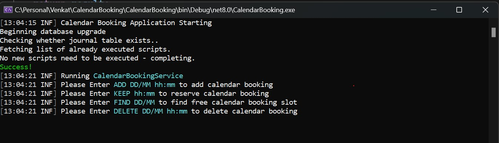
- 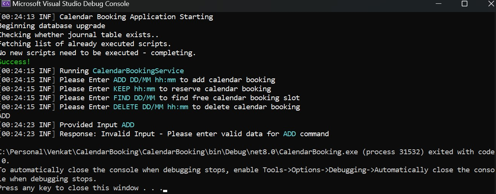
- 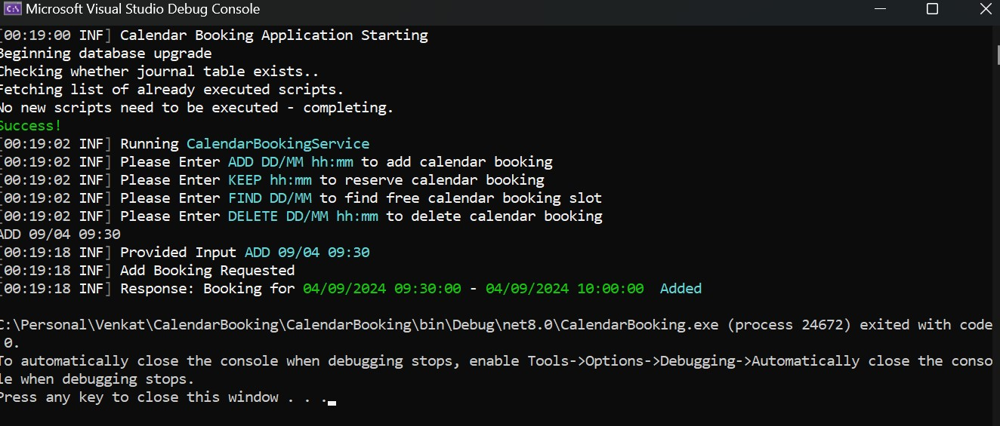
- 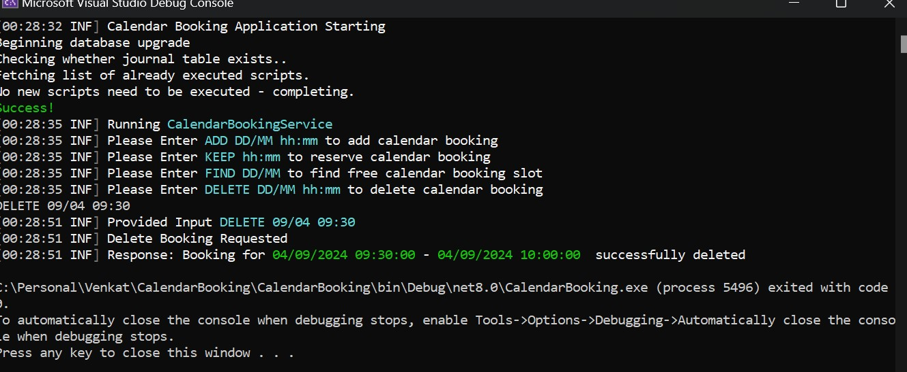
- 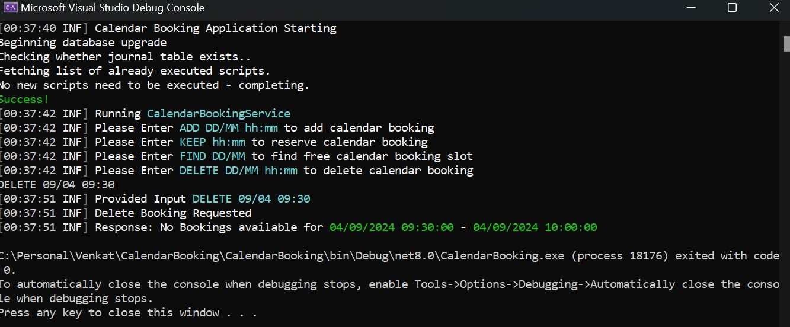
- 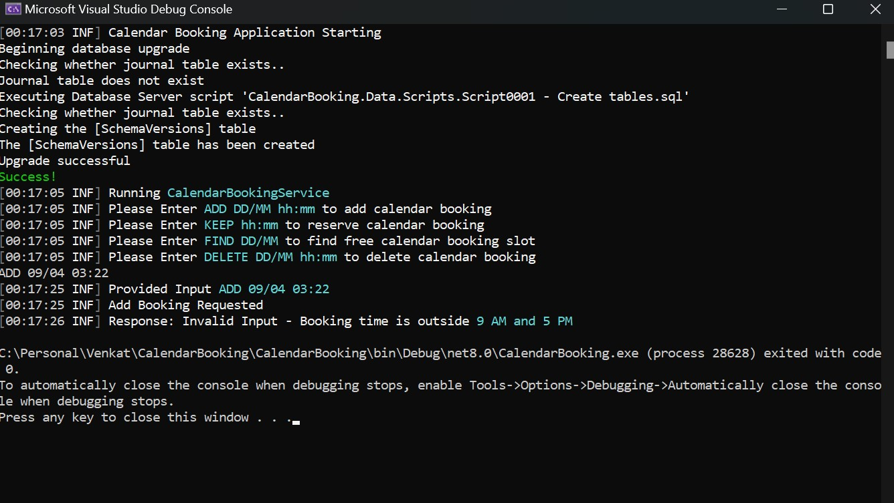
- 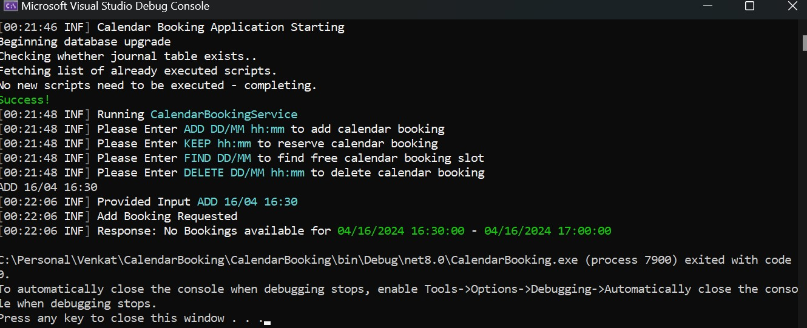
- 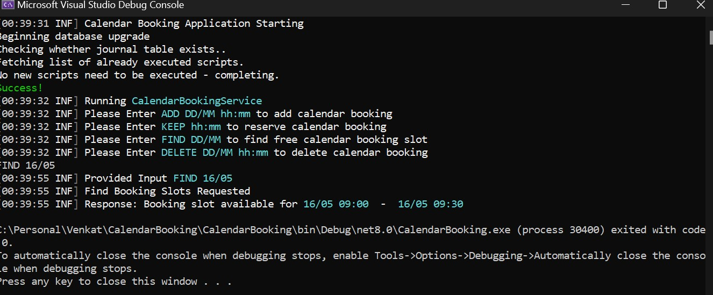
- 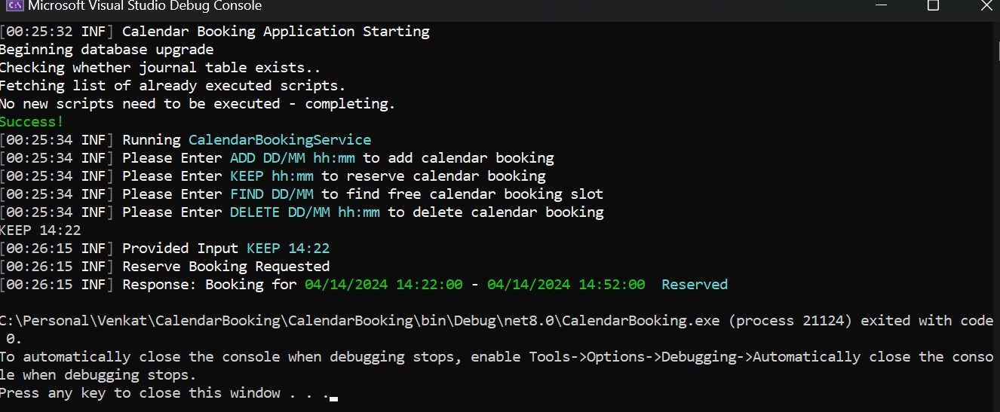
- 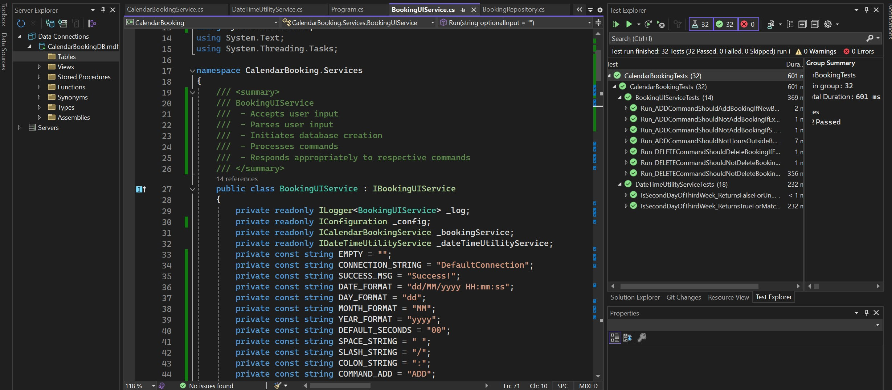
- 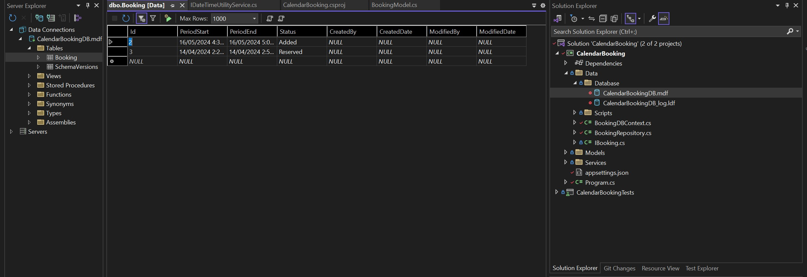

# My Feedback

I focused on making the solution function as per the requirements and I have used best practices in chosing packages and organizing code
I used

- Dependency Inversion Pattern for managing dependencies
- DbUp for database changes management
- Repository Pattern for data access
- Dapper light weight micro ORM for data access (CRUD)
- Used Serilog for effective logging
- Used Nodatime for datetime calculations

I have written adequate unitests to make sure the solution is functioning in accordance with the given requirements.

I have not focussed much on validations due to time constraint, if more time available I could implement robust input and model validations.

Further if more time is available, I would have focused on providing these functionalities as well

- Configurable parameter or keys in key vault.
- Would have created a relational database with more entities and include normalisation principles.
- Hosting on Cloud platform and services for hosting
- Would have used some front-end technology for UI experience
- Would have implemented robust Exception handling

Thank you for the opportunity.
